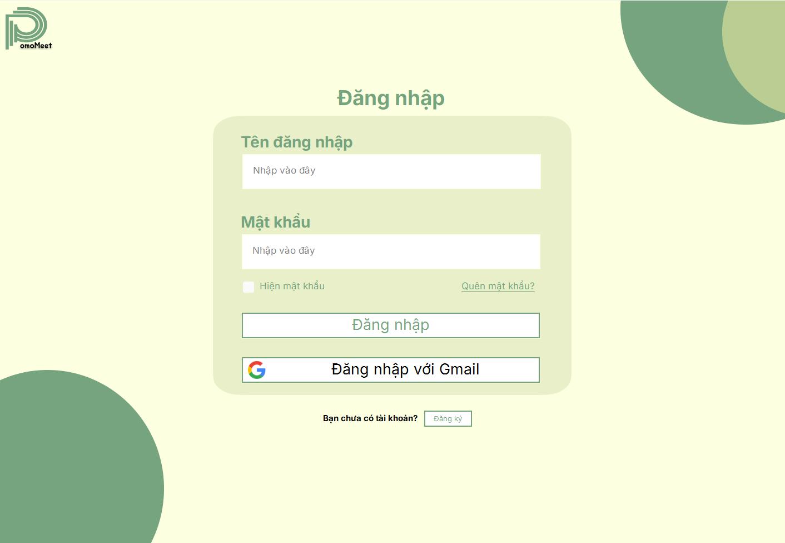

# 🕐 PomoMeet - Ứng dụng học nhóm trực tuyến tích hợp Pomodoro

**PomoMeet** là một ứng dụng desktop học nhóm giúp người dùng duy trì sự tập trung bằng phương pháp Pomodoro, kết hợp với tính năng tạo phòng học nhóm, video call qua Agora, chia sẻ nền nhạc và đồng hồ Pomodoro đồng bộ giữa các thành viên. Giao diện được xây dựng bằng **Windows Forms C#**, backend sử dụng **Google Firestore** và **Agora SDK**.

---

## 👨‍👩‍👧‍👦 Nhóm phát triển

| Họ và tên                | MSSV      | Vai trò          |
|--------------------------|-----------|------------------|
| Trần Thị Phương Linh     | 23520851  | Trưởng nhóm      |
| Võ Nguyễn Ngọc Thùy      | 23521561  | Thành viên       |
| Đậu Đức An Phú           | 23521179  | Thành viên       |

---

## 🔖Tính năng đầy đủ

### *1. Đăng nhập và đăng ký*
- Hỗ trợ đăng ký tài khoản bằng email và mật khẩu.
- Hỗ trợ đăng nhập nhanh thông qua Google OAuth.
- Bảo mật mật khẩu bằng cách mã hóa trước khi lưu vào hệ thống.
- Lưu trạng thái người dùng (Online/In Call/Offline) khi đăng nhập/thoát ra.

### *2. Tạo và tham gia phòng học nhóm*
- Cho phép người dùng tạo phòng công khai hoặc riêng tư.
- Phòng riêng tư có thể đặt mật khẩu, chỉ người có mật khẩu mới tham gia được.
- Thành viên có thể tham gia phòng thông qua mã hoặc chọn từ danh sách phòng hiện có.

### *3. Gọi video nhóm qua Agora SDK*
- Tích hợp Agora SDK để hỗ trợ video call.
- Hiển thị video hoặc avatar tùy theo trạng thái camera của người dùng.
- Tắt/mở micro và camera trong quá trình gọi.
- Cập nhật trạng thái video/mic của tất cả thành viên trong thời gian thực.

### *4. Tính năng Pomodoro học nhóm*
- Hỗ trợ thiết lập thời gian Pomodoro:
  - Thời gian học (Pomodoro duration)
  - Thời gian nghỉ ngắn (Short break)
  - Thời gian nghỉ dài (Long break)
  - Số vòng lặp (session count)
- Chủ phòng (host) có quyền điều khiển đồng hồ Pomodoro:
  - Bắt đầu (Start)
  - Tạm dừng (Pause)
  - Đặt lại (Reset)
- Nhạc nền và hình nền được đồng bộ giữa các thành viên khi Pomodoro bắt đầu.
- Thời gian đếm ngược hiển thị rõ ràng, cập nhật theo thời gian thực thông qua Firestore.

### *5. Quản lý trạng thái người dùng*
- Trạng thái người dùng được lưu và cập nhật liên tục:
  - Online: người dùng đang mở ứng dụng.
  - In Call: người dùng đang tham gia phòng học nhóm.
  - Offline: người dùng đã thoát ứng dụng.
- Cập nhật trạng thái thông qua Firestore giúp các phòng hoạt động ổn định, đồng bộ.

### *6. Quản lý và hiển thị danh sách phòng học*
- Danh sách tất cả các phòng đang hoạt động được hiển thị cho người dùng.
- Hỗ trợ phân trang để hiển thị số lượng lớn phòng.
- Tìm kiếm theo tên phòng hoặc mã phòng.

### *7. Giao diện phòng học nhóm*
- Hiển thị danh sách thành viên trong phòng với:
  - Tên người dùng
  - Avatar
  - Trạng thái micro/camera
  - Phân biệt rõ ai là host
- Người bị kick khỏi phòng sẽ tự động bị đóng phiên và không thể quay lại.
- Chủ phòng có quyền kick thành viên hoặc chuyển quyền host cho người khác.

### *8. Tự động cập nhật giao diện phòng học*
- Giao diện tự động cập nhật khi:
  - Có người tham gia hoặc rời khỏi phòng
  - Trạng thái mic/camera thay đổi
  - Host thay đổi
  - Pomodoro được bắt đầu/tạm dừng/reset

### *9. Bảo mật hệ thống*
- Mật khẩu người dùng được mã hóa khi lưu trong cơ sở dữ liệu.
- Mỗi phòng riêng tư đều được xác thực bằng mật khẩu.
- Kiểm tra quyền truy cập trước khi cho phép vào phòng.
- Giới hạn quyền điều khiển Pomodoro và quản lý phòng chỉ dành cho host.

### *10. Tài nguyên nội bộ*
- Nhạc nền và background được lưu trong file tài nguyên nội bộ (`resource.resx`).
- Dễ dàng mở rộng số lượng bài nhạc hoặc hình nền.

---

## 🧑‍💻 Công nghệ sử dụng

| Thành phần              | Công nghệ                     |
|------------------------|-------------------------------|
| Ngôn ngữ chính          | C# (.NET Framework)           |
| Giao diện người dùng    | Windows Forms                 |
| Realtime Database       | Firebase Firestore            |
| Video Call SDK          | Agora .NET SDK                |
| OAuth đăng nhập         | Google OAuth 2.0              |
| Nhạc/Nền                 | Tải từ resource nội bộ (.resx)|

---